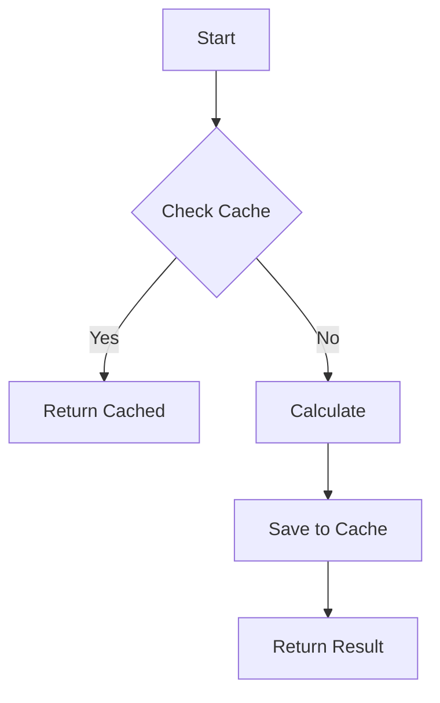

# @xray Decorator

The `@xray` decorator provides deep visibility into function execution. It logs inputs, outputs, and execution time to the debug console.

## Usage

```python
from shadowbar import xray

@xray
def complex_calculation(x, y):
    return x * y
```

When this function is called, you will see a detailed trace in the logs.

## Visual Flow

ShadowBar can generate a visual flowchart of the execution path for `@xray` decorated functions.


